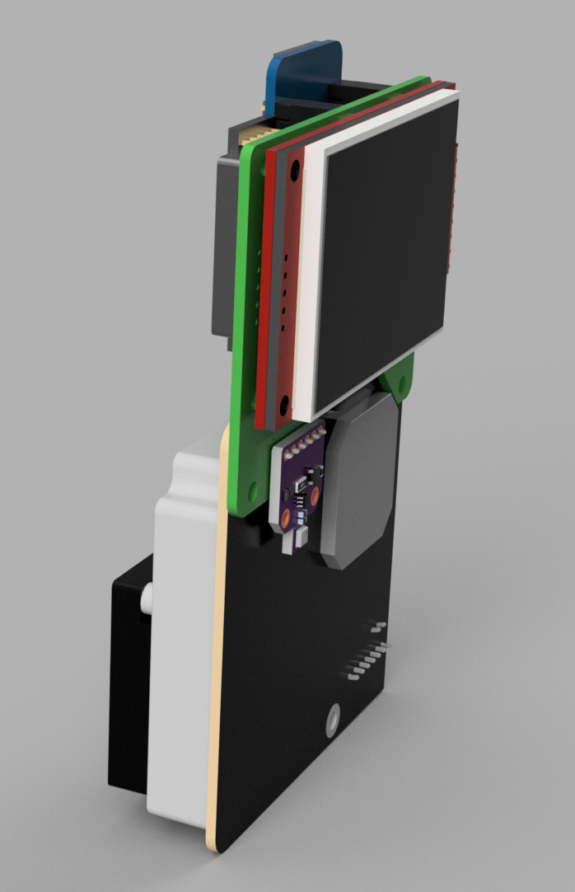
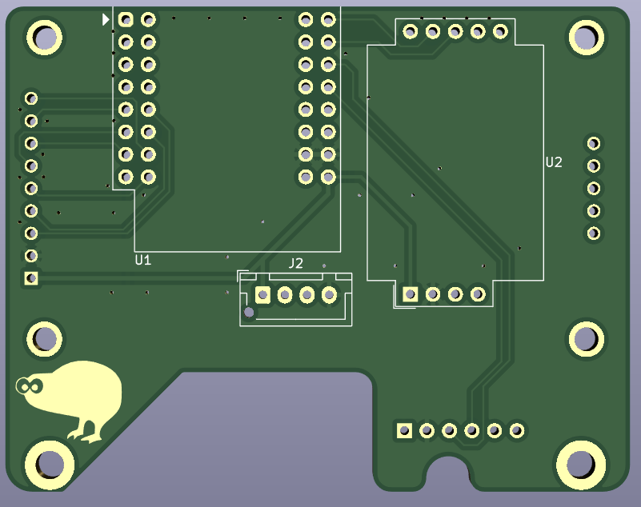
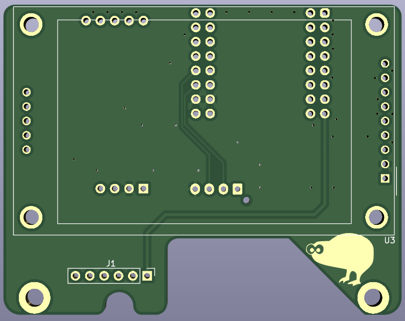

# AirQ

This is a small PCB meant to work with a WEMOS S2.  
All sensors should work if using a D1 mini, but the display won't

This takes:  

- Sensair S8 CO2 sensor
- BME680 breakout board for pressure, temperature, humidity, and VOC
- SDS011 particle counting sensor
- A 2.2" ILI9341 LCD. (S2 mini only)

and connects it all to a WeMOS S2 mini (or D1 mini sans LCD)

Everything is meant to bolt or solder to the PCB, making packaging easier.

